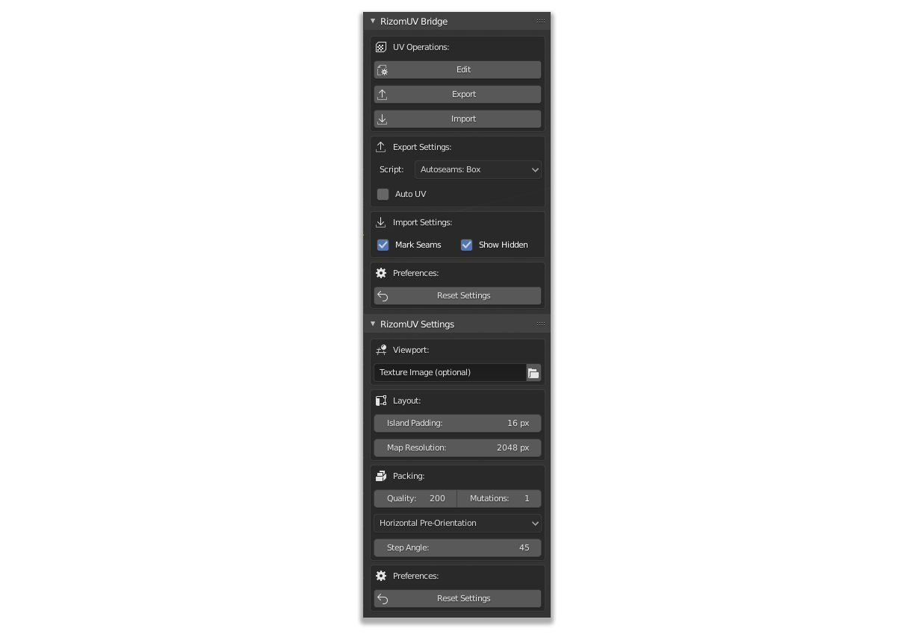

    <h1 align="center">RizomUV Bridge For Blender</h1>
    
This addon is a bridge between Blender and RizomUV. Specifically developed for Blender 2.8.

<strong><a href="https://mattashpole.github.io/BlenderRizomUVBridge/">Github Pages Documentation</a></strong>

<strong><a href="https://www.paypal.com/paypalme/my/profile?locale.x=en_US&country.x=US">Donations</a></strong>

       

